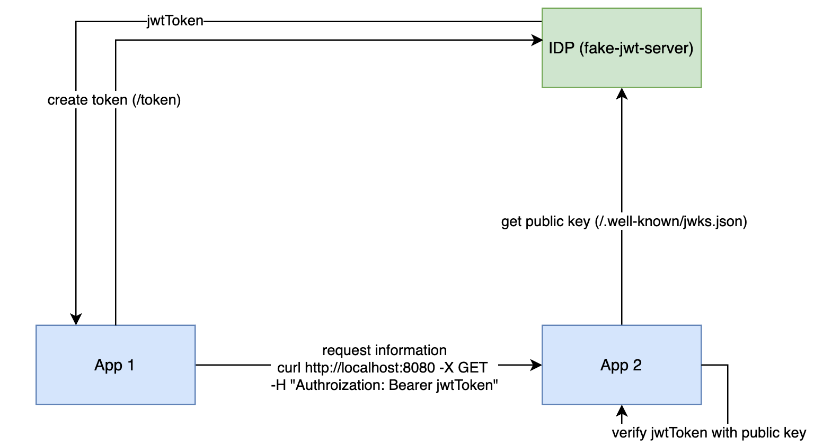

# Introduction

A straightforward mock-up of an identity provider (IDP) is designed to issue JWTs, enhancing the security of
communications between services.



To safeguard service interactions, various methods are available such as mutual TLS, basic authentication, or bearer
authentication, to name a few. In bearer authentication, a token is required from an IDP, like Keycloak or Okta, through
the client credentials grant of OAuth 2.0. Once the JWT is acquired, it can be transmitted in the authorization header
when a service communicates with another. The recipient service can then verify the token using the IDP's public key.
During local development or integration testing, utilizing a real IDP may not be desirable. This is where the concept of
a fake-jwt-server is introduced. It's a basic version of an IDP that issues JWTs for OAuth flows and provides a public
key endpoint for token verification.

# Running the Server

To launch the server in a Docker container, execute the following command:

```bash
docker run -p 8008:8008 ghcr.io/stackitcloud/fake-jwt-server:v0.1.1
```

This command initializes the server on port 8008. The public key can be accessed
at http://localhost:8008/.well-known/jwks.json, and the OAuth token endpoint is available
at http://localhost:8008/token.

# Configuration

The server's settings can be adjusted using specified environment variables and flags.

| Environment Variable | Flag                   | Description                                                               |
|----------------------|------------------------|---------------------------------------------------------------------------|
| `PORT`               | `--port`               | The port the server listens on. Defaults to `8008`.                       |
| `ISSUER`             | `--issuer`             | The issuer of the tokens. Defaults to `test`.                             |
| `AUDIENCE`           | `--audience `          | The audience of the tokens. Defaults to `test `.                          |
| `SUBJECT`            | `--subject`            | The subject of the tokens. Defaults to `test`                             |
| `ID`                 | `--id`                 | The id of the tokens. Defaults to `test`.                                 |
| `EXPIRES_IN_MINUTES` | `--expires-in-minutes` | The expiration time of the JWT tokens in minutes. Defaults to `52560000`. |
| `GRAND_TYPE`         | `--grand-type`         | The grand type of the JWT tokens. Defaults to `client_credentials`.       |
| `EMAIL`              | `--email`              | The email of the JWT token. Defaults to `test@example.com`.               |
